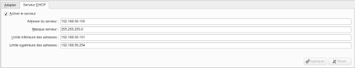
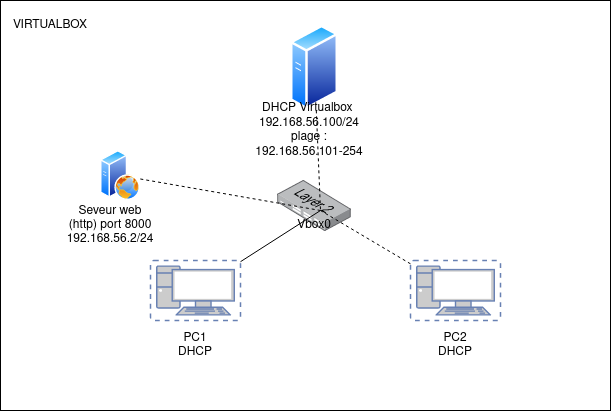

# TP1 Compte-rendu R5.ROM.11

## 1. Téléchargement de l'image Debian pour VirtualBox

Téléchargez une image Debian spécialement adaptée pour VirtualBox à partir de ce [lien](https://www.osboxes.org/debian/).

## 2. Clonage de l'image Debian

- Importez l’image sur Debian via le menu : `Fichier -> Importer`.
- Clonez la machine originale deux fois. Pour cela, faites un clic droit sur la machine et sélectionnez l'option appropriée.
- Assurez-vous de randomiser l'adresse MAC pour chaque clone. Vous pouvez le faire en cochant l'option "randomiser les adresses MAC" lors du clonage.

## 3. Configuration du réseau

Effectuez les étapes suivantes pour chaque instance (la machine originale et ses deux clones) :

1. Configurez-les en "réseaux privés d’hôte". Pour ce faire, allez dans : `Configuration -> Réseau -> Mode d’accès : réseaux privés d'hôte vbox0`.
   
2. Accédez aux propriétés de VirtualBox (`ctrl+H`), puis allez dans : `host only network -> Vbox0 -> Serveur DHCP` et ajustez les adresses IP comme souhaité.

|  | 
|:--:| 
| *Configuration IP* |

## 4. Mise en place du serveur web

Sur la première machine :

1. Lancez un serveur web avec la commande : 
   ```
   python -m http.server 8000
   ```
   
2. Attribuez une adresse IP fixe en utilisant les commandes suivantes :
   ```
   sudo ip addr add 192.168.56.2/24 dev enp0s3
   sudo ip link set enp0s3 up
   ```

   :::caution

   Prenez garde à ce que **l'interface** dont vous modifiez l'addresse ici `enp0s3` correspond bien à celle de votre VM. Pour trouver le nom de votre interface faite `ip a`.

   :::
## Récapitulatif
Ci dessous vous trouverez le schéma récapitulatif de l'architecture présenté.

|  | 
|:--:| 
| *Architecture réseau* |
